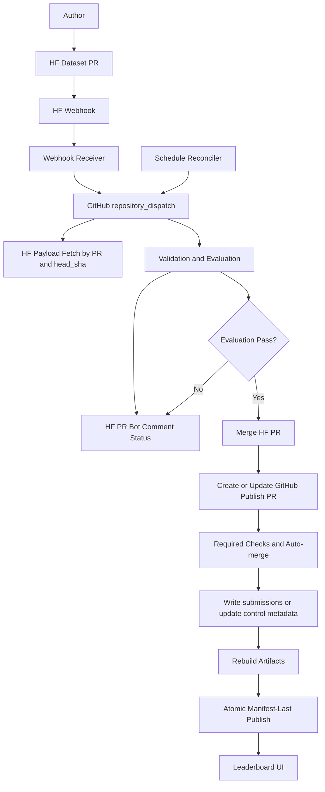
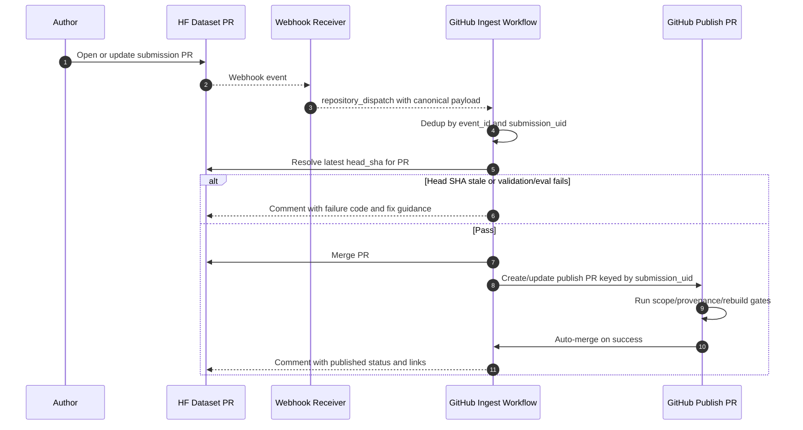

# HF Direct PR Hard Cutover Plan

## Status
Draft v2 (for review)

## Goal
Replace GitHub submission-PR intake with Hugging Face (HF) dataset PR intake as the only user submission path.

Hard cutover intent:
- No legacy dual-ingestion path.
- No compatibility mode.
- All contributor interaction happens in HF PR discussions.

## Decision Summary
1. HF dataset PRs are the only ingress for submission payloads.
2. GitHub remains the control-plane and publish source of truth.
3. Processing uses one ingestion flow with two triggers:
   - webhook fast-path through a verified bridge
   - scheduled reconciler safety path
4. On successful evaluation, automation merges HF PR, creates a small GitHub publish PR, and auto-merges only when strict gates pass.

## Hard Assumptions (Non-Negotiable)
1. Exactly one HF dataset repo is accepted as ingress (`HF_REPO_CANONICAL`).
2. Data branch remains `leaderboard-submissions`.
3. Published artifacts remain at branch root (same as current contracts).
4. Cutover preflight requires no pre-existing canonical files in `submissions/*.json`; if present, cutover aborts until branch is reset for first deployment.

## Acceptance Criteria
1. For a given `submission_uid`, repeated webhook/schedule runs create at most one publish PR and one published result.
2. When HF PR head SHA changes, older in-flight runs never publish.
3. Publish remains manifest-last atomic, and smoke check passes against the live manifest URL.
4. All user-facing failures and success states are visible in HF PR comments.
5. Reconciler can recover `accepted_pending_publish` records without manual JSON edits.

## Scope
In scope:
- Use `.github/workflows/leaderboard-hf-ingest.yml` as HF PR-based intake workflow.
- Use `.github/workflows/leaderboard-hf-publish-pr.yml` as publish/update workflow.
- Keep publish semantics from `leaderboard/scripts/publish.py` (manifest-last atomic publish).
- Keep rebuild responsibilities from `.github/workflows/leaderboard-rebuild.yml`.
- Remove canonical identity coupling `submission_id == github_pr_number` in `src/webarena_verified/types/leaderboard/submission_record.py`.

Out of scope:
- Supporting GitHub `submissions/inbox/**` user submissions after cutover.
- User-triggered GitHub issue execution path.
- Multi-repo HF ingestion.

## Component Architecture

## Execution Flow

## Trigger Bridge Contract
Webhook receiver must:
1. Verify shared secret before forwarding.
2. Forward only events for `HF_REPO_CANONICAL`.
3. Emit `repository_dispatch` with `event_type=hf_submission_event` and payload:
   - `event_id` (unique bridge event id)
   - `event_scope`, `event_action`, `event_ts`
   - `hf_repo`, `hf_pr_number`, `hf_head_sha`
4. Preserve idempotency by forwarding the same `event_id` on retries.

GitHub ingest workflow must:
1. Reject payloads with missing required fields.
2. Ignore events not matching `HF_REPO_CANONICAL`.
3. No-op when `event_id` already processed.
4. Re-fetch HF PR state before processing (event payload is advisory, HF API is authoritative).

Bridge implementation ownership (in scope for this cutover):
1. Receiver runs as dedicated service managed by leaderboard maintainers.
2. Receiver deployment and secret management are part of this hard cutover scope.
3. If receiver is unavailable, schedule reconciler remains the guaranteed trigger path.

Concrete deployment contract:
1. Service location: `leaderboard/bridge/hf_webhook_receiver/` in this repository.
   - This directory/component is created as part of this hard cutover.
2. Hosting target: single HTTP service endpoint deployed by maintainers.
3. Endpoint path: `POST /webhook/hf-submissions`.
4. Required receiver configuration:
   - `HF_WEBHOOK_SECRET`
   - `GITHUB_REPOSITORY` (owner/repo)
   - `GITHUB_DISPATCH_TOKEN` (permission to call repository dispatch)
5. Required GitHub dispatch target:
   - event type: `hf_submission_event`
   - workflow listening on `repository_dispatch` for that event.

Dedup persistence rules:
1. Webhook runs dedupe on `event_id` stored in control record metadata (`processed_event_ids[]`, bounded ring buffer of latest 32 ids).
2. Schedule runs do not require `event_id`; they dedupe by current HF `head_sha` versus control record `hf_head_sha` and current status.
3. `processed_event_ids[]` pruning is deterministic (drop oldest first).

## Single Flow, Dual Trigger Policy
The ingestion logic is one flow and one code path.

- Webhook trigger: low latency, best effort.
- Schedule trigger: authoritative reconciler for missed webhooks and stuck states.
- Both triggers run identical idempotent logic.

## Submission Identity and Idempotency
Canonical immutable run key:
`submission_uid = hf:{hf_repo}:pr-{hf_pr_number}@{hf_head_sha}`

Canonical submission id allocator (hard-cut rule):
`submission_id = hf_pr_number`

Guardrails:
1. Safe only because ingress is restricted to one repo (`HF_REPO_CANONICAL`).
2. `submission_id` remains integer and preserves ranking tie-break compatibility.
3. Same PR with a new SHA supersedes older attempts (update, not duplicate).
4. Duplicate is an error only when the same `submission_id` maps to conflicting repo identity.

HF intake payload contract (explicit):
1. Each HF PR must contain exactly one intake folder:
   - `submissions/inbox/pr-<hf_pr_number>/`
2. Required files under that folder:
   - `submission.json`
   - `manifest.json`
   - `tasks/<task_id>/` with either `.missing` or (`agent_response.json` + `network.har`)
3. Task folder names must be numeric.
4. Ingest fetches and validates this folder at pinned `hf_head_sha` before evaluation.

## Source of Truth and State Model
Source of truth by layer:
1. Payload bytes and contributor conversation: HF PR.
2. Processing state: control records in GitHub.
3. Publication decision and leaderboard rows: canonical accepted records in GitHub.
4. Public leaderboard output: published JSON artifacts + manifest in GitHub.

Terminal policy:
- Accepted and published: HF PR merged, publish PR merged, canonical output persisted.
- Rejected: HF PR closed with reason and diagnostics.

## State Transition Table

| From | To | Owner | Condition |
|---|---|---|---|
| `pending` | `validating` | ingest workflow | candidate selected |
| `validating` | `evaluating` | ingest workflow | structural validation passes |
| `validating` | `rejected` | ingest workflow | structural validation fails |
| `evaluating` | `accepted_pending_publish` | ingest workflow | evaluation passes and HF PR merged |
| `evaluating` | `rejected` | ingest workflow | evaluation terminal failure |
| `evaluating` | `failed_retryable` | ingest workflow | transient infra/runtime failure |
| `accepted_pending_publish` | `published` | publish workflow | publish PR merged and rebuild passed |
| `accepted_pending_publish` | `failed_retryable` | publish workflow | publish PR/checks fail transiently |
| `failed_retryable` | `validating` | reconciler | retry policy allows rerun |

Supersession rule:
- If latest HF head SHA differs from run SHA, run appends `status_history` entry with `status="superseded"`, `run_sha`, `latest_sha`, and exits without publish side effects.
- A run may update canonical status only if `record.hf_head_sha == run_sha` at write time (compare-and-swap guard).

## GitHub Storage Layout (Aligned With Current Contracts)
Data branch:
- `leaderboard-submissions`

Control records (lifecycle + dedup only):
- `submission_control/<submission_id>.json`

Canonical records:
- `submissions/<submission_id>.json`

Published artifacts at branch root:
- `leaderboard_manifest.json`
- `leaderboard_full.<generation_id>.json`
- `leaderboard_hard.<generation_id>.json`

Status metadata storage:
- Stored in control records via fields such as `submission_uid`, `hf_head_sha`, `status`, `status_history[]`, `github_publish_pr_number`, `github_publish_merge_sha`, `processed_event_ids[]`, `retry_count`.

## Path and Consumer Contract Matrix

| Path | Writer | Reader/Consumer |
|---|---|---|
| `submission_control/<submission_id>.json` | ingest/publish/reconciler workflows | ingest/publish/reconciler workflows |
| `submissions/<submission_id>.json` | ingest/publish workflow | `leaderboard/scripts/publish.py`, rebuild workflow |
| `leaderboard_manifest.json` | rebuild/publish workflow | site build default URL, smoke workflow, UI runtime |
| `leaderboard_full.<generation_id>.json` | rebuild/publish workflow | UI runtime, smoke workflow |
| `leaderboard_hard.<generation_id>.json` | rebuild/publish workflow | UI runtime, smoke workflow |

## Required Invariants (Must Preserve)
1. Atomic publish remains manifest-last and rollback-safe (`leaderboard/scripts/publish.py`).
2. Deterministic ranking remains `overall_score DESC`, tie-break `submission_id ASC`.
3. Duplicate canonical submission IDs remain invalid unless they are an allowed same-PR supersession update.
4. Single-writer concurrency remains enforced for data writes (`leaderboard-data-writer`).
5. Task payload invariants remain enforced:
   - `.missing` xor (`agent_response.json` + `network.har`)
   - numeric task directory naming
   - manifest checksum and size integrity

## Workflow Changes (Hard Cut)
Retire intake path:
- GitHub contributor submission PR flow under `submissions/inbox/**`.

Add/replace workflows:
1. `leaderboard-hf-ingest.yml`
   - Triggers: `repository_dispatch`, `schedule`, `workflow_dispatch`
   - Concurrency: `hf-pr-${hf_pr_number}` with cancellation for stale runs
   - Responsibilities: discover/validate/evaluate candidates, comment status, merge HF PR on pass, create/update publish PR
   - Candidate discovery:
     - from dispatch payload (`hf_pr_number`) when trigger is webhook
     - from HF API list of open PRs updated in last 7 days when trigger is schedule
     - plus local canonical records with status in `{accepted_pending_publish, failed_retryable}`
   - Bounds:
     - max 50 candidates per scheduled run
     - exponential retry backoff (1m, 5m, 30m) with `retry_count <= 8`, then manual override required
2. `leaderboard-hf-publish-pr.yml` (or integrated publish job)
   - Trigger: bot publish PR updates
   - Base branch: `leaderboard-submissions`
   - Responsibilities: enforce allowlist/provenance/rebuild gates, verify target SHA is latest accepted SHA, auto-merge on pass

Retain:
- `leaderboard-smoke.yml` for external smoke checks.
- `leaderboard-site-build.yml` for UI manifest contract checks.

## Data Model Changes
Update `src/webarena_verified/types/leaderboard/submission_record.py`:
1. Remove `submission_id == github_pr_number` validator.
2. Keep canonical `status` as accepted-only for publish compatibility.
3. Add provenance fields:
   - `submission_uid`
   - `hf_repo`
   - `hf_pr_number`
   - `hf_head_sha`
   - `hf_pr_url`
4. Keep canonical records as accepted/published-only records with required score fields (no in-flight statuses in canonical files).
5. Add/maintain a separate lightweight control record schema for `submission_control/<submission_id>.json` containing lifecycle status and dedup fields.
6. GitHub provenance compatibility rule:
   - `github_pr_number` and `github_pr_url` are repurposed to the bot publish PR identity.
   - Source ingestion provenance uses HF fields only (`hf_repo`, `hf_pr_number`, `hf_pr_url`, `hf_head_sha`).
7. Legacy GitHub intake provenance fields policy:
   - `source_repository_id`, `source_repository_full_name`, `github_pr_author_id`, `github_pr_author_login` become optional for HF-ingested records.
   - HF-ingested records populate new HF provenance fields and do not require legacy GitHub intake values.
   - Existing records remain unchanged; no backfill required before first deployment.
8. HF mapping for existing required canonical fields:
   - `hf_path = submissions/inbox/pr-<hf_pr_number>/`
   - `hf_revision = <merged_hf_commit_sha>`

## Auto-merge Safety Gates for GitHub Publish PR
All must pass:
1. Provenance gate:
   - HF PR is merged.
   - publish PR references exact `submission_uid` and `hf_head_sha`.
   - `hf_head_sha` in publish PR equals latest accepted `hf_head_sha` in canonical record.
2. Scope gate:
   - allowlisted files only: `submissions/*.json`, `leaderboard_manifest.json`, `leaderboard_full.*.json`, `leaderboard_hard.*.json`.
3. Determinism gate:
   - generated hashes match manifest fields.
4. Rebuild gate:
   - rebuild command succeeds and smoke schema checks pass.
5. Concurrency gate:
   - no conflicting active writer in `leaderboard-data-writer` group.

## Failure Handling and Recovery
Failure classes:
1. Validation failure: comment on HF PR with actionable code and fix guidance.
2. Evaluation failure: comment on HF PR with run links and diagnostics.
3. Publish failure after HF merge:
   - record `accepted_pending_publish`
   - reconciler retries by updating existing publish PR (if open) or reopening replacement keyed by `submission_uid`
   - transition to `published` only after publish PR merge and rebuild success

Permanent failure handling:
- If retries exceed limit, set `failed_retryable` with `requires_manual_override=true` and alert maintainers.

Rollback rule:
- Publication rollback happens in GitHub (revert publish PR changes), never by rewriting HF history.

## Security and Trust Boundaries
1. Treat HF PR content as data only; never execute contributor code.
2. Verify webhook secret at receiver and reject invalid payloads.
3. Least-privilege tokens:
   - HF token: PR read/comment/merge only
   - GitHub token: bot branch, PR, and merge operations only
4. Apply size/shape validation before evaluation.

## Operations and Runbook Minimum
1. Metrics: counts by status, age-in-status, retry counts, superseded runs.
2. Alerts: stuck `accepted_pending_publish` over threshold.
3. Manual override: maintainers may set terminal status only with `status_history` reason entry.
4. Manual override allowed terminal statuses after HF merge:
   - `published`
   - `failed_retryable` (with override note)
   - `rejected` is not allowed once HF PR is merged.

## Review Checklist
1. Is webhook bridge contract explicit (schema, auth, dedup)?
2. Is `submission_id` allocation rule executable and deterministic?
3. Are state transitions owner-scoped and retry-safe?
4. Are paths fully aligned with existing consumers?
5. Are auto-merge gates testable and enforceable?
