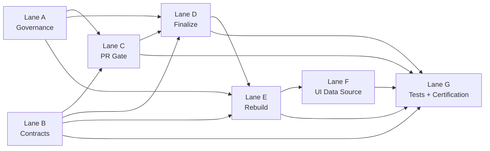

# Leaderboard Implementation Plan (Parallel Lanes)

This plan implements the approved `leaderboard-submissions` architecture.

## Scope

- Intake via PRs to `leaderboard-submissions`
- Intake payload path: `submissions/inbox/<intake_id>/...`
- Canonical ID: `submission_id = <pr_number>`
- Canonical state: `submissions/<submission_id>.json`
- Leaderboard outputs:
  - `leaderboard_full.<generation_id>.json`
  - `leaderboard_hard.<generation_id>.json`
  - `leaderboard_manifest.json`
- UI data source from build-time env `PUBLIC_LEADERBOARD_MANIFEST_URL`
- Retention in rebuild workflow: latest 100 canonical records

## Lane files

- Lane A: `.wip/lane-a-governance.md`
- Lane B: `.wip/lane-b-contracts.md`
- Lane C: `.wip/lane-c-pr-gate.md`
- Lane D: `.wip/lane-d-finalize.md`
- Lane E: `.wip/lane-e-rebuild.md`
- Lane F: `.wip/lane-f-ui-data-source.md`
- Lane G: `.wip/lane-g-tests-certification.md`

## Lane interactions

## Ownership boundaries

- **User-editable path only:** `submissions/inbox/<intake_id>/**`
- **Finalize-only writes:** `submissions/<submission_id>.json`
- **Rebuild-only writes:** leaderboard output files (`leaderboard_full.*`, `leaderboard_hard.*`, `leaderboard_manifest.json`)

## Execution strategy

- Start in parallel: Lane A, Lane B, Lane F
- Then: Lane C
- Then: Lane D
- Then: Lane E
- Finish: Lane G certification

## Current phase (post-E merge)

- Lane E is merged.
- Lane F implementation is complete.
- Active focus: complete Lane G end-to-end certification.
- Immediate path: `G08`.

## Critical path

`A -> B -> C -> D -> E -> G`

## Milestones

- M1: Governance and contracts frozen (A+B)
- M2: Gate and finalize running (C+D)
- M3: Single-writer rebuild and retention active (E)
- M4: UI source switched and verified (F)
- M5: Certification complete (G)
