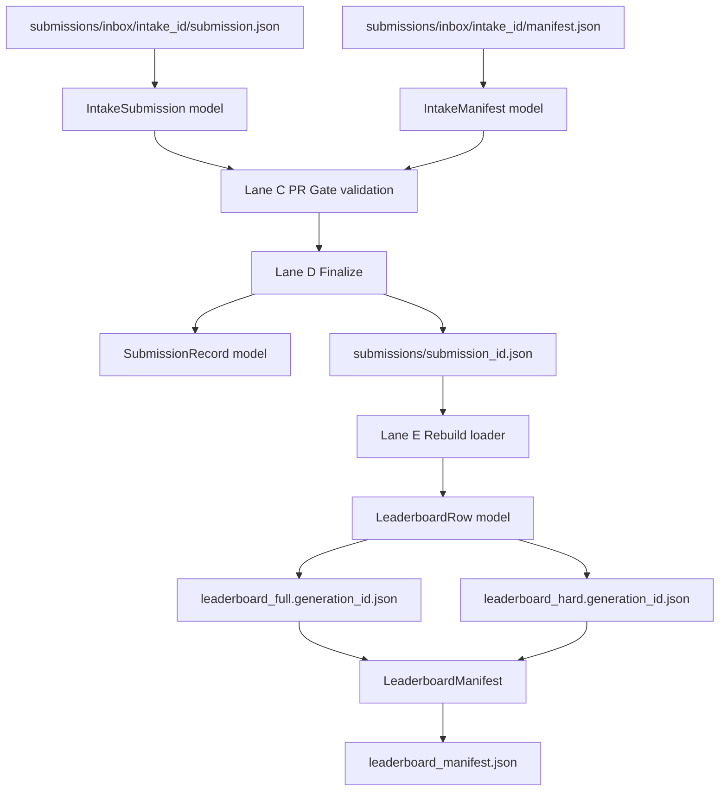
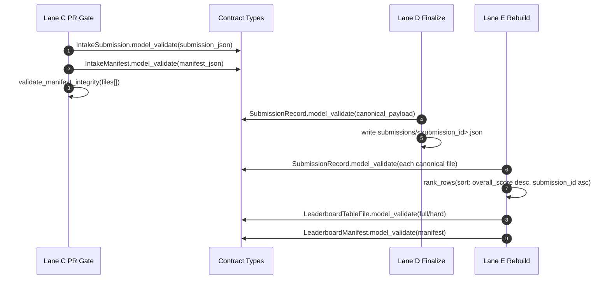

# Lane B Contracts Implementation Plan (Detailed)

This plan freezes contract code for intake, canonical records, and leaderboard outputs.

## Locked decisions

- `submission_id` is an integer in all models and runtime sort keys.
- Deterministic identity rule: `submission_id = github_pr_number`.
- Contract validation is strict by default (`extra="forbid"`) for all new/updated Lane B models.

## Scope

- B01 intake path contract for `submissions/inbox/<intake_id>/...`
- B02 `submission.json` schema
- B03 `manifest.json` schema
- B04 canonical record schema `submissions/<submission_id>.json`
- B05 leaderboard generation contract and sort invariants

## Deliverables

- Canonical Pydantic contracts in `src/webarena_verified/types/leaderboard/`
- Dev workflow consumers updated to those canonical contracts
- Contract test coverage in `tests/types/` and workflow-level behavior checks in `tests/leaderboard/`
- Migration notes in `.wip/` docs for Lane C/D/E handoff

## Current contract gaps to close

- `src/webarena_verified/types/leaderboard/submission_payload.py` still models HF payload artifacts, not intake inbox contracts.
- `src/webarena_verified/types/leaderboard/submission_record.py` still models pending/accepted/rejected control-plane state, not accepted canonical submission state.
- `submission_id` is currently string-based in key models and ranking tie-break logic.
- `dev/leaderboard/models.py` duplicates contract types and risks drift from canonical types.

## B01/B02/B03 intake contracts

### Files

- `src/webarena_verified/types/leaderboard/submission_payload.py`
- `src/webarena_verified/types/leaderboard/_validators.py` (reuse, add path guard helper)
- `src/webarena_verified/types/leaderboard/__init__.py`

### Planned signatures

```python
from typing import Literal
from pydantic import BaseModel, ConfigDict, Field, field_validator, model_validator


class IntakeSubmission(BaseModel):
    model_config = ConfigDict(extra="forbid")

    name: str = Field(min_length=1)
    leaderboard: Literal["hard", "full", "both"]
    reference: str = Field(min_length=1)
    created_at_utc: str
    packaging_summary: dict[str, int]
    version: str | None = None
    contact_info: str | None = None


class IntakeManifestFile(BaseModel):
    model_config = ConfigDict(extra="forbid")

    path: str = Field(min_length=1)
    sha256: str
    size_bytes: int = Field(ge=0)


class IntakeManifest(BaseModel):
    model_config = ConfigDict(extra="forbid")

    schema_version: str = Field(min_length=1)
    created_at_utc: str
    files: list[IntakeManifestFile] = Field(min_length=1)

    @model_validator(mode="after")
    def validate_unique_paths(self) -> "IntakeManifest": ...
```

### Validation rules

- `IntakeManifestFile.path` must be relative, must not start with `/`, and must not include `..` segments.
- `sha256` must be lowercase 64-hex.
- `created_at_utc` must match RFC3339 UTC `...Z`.
- `submission.json` requires exactly the approved fields (no unknown keys).
- `manifest.json` requires exactly the approved fields (no unknown keys).

### Lane interactions

- Lane C (PR Gate) consumes `IntakeSubmission` + `IntakeManifest` for structural checks and manifest integrity checks.
- Lane D (Finalize) consumes `IntakeSubmission` after merge to build canonical record.

## B04 canonical record contract

### Files

- `src/webarena_verified/types/leaderboard/submission_record.py`
- `src/webarena_verified/types/leaderboard/__init__.py`

### Planned signatures

```python
from typing import Literal
from pydantic import BaseModel, ConfigDict, Field, model_validator


class SubmissionRecord(BaseModel):
    model_config = ConfigDict(extra="forbid")

    submission_id: int = Field(ge=1)
    github_pr_number: int = Field(ge=1)
    github_pr_url: str = Field(min_length=1)

    source_repository_id: int = Field(ge=1)
    source_repository_full_name: str = Field(min_length=1)
    github_pr_author_id: int = Field(ge=1)
    github_pr_author_login: str = Field(min_length=1)

    status: Literal["accepted"] = "accepted"
    eval_completed_at_utc: str
    evaluator_version: str = Field(min_length=1)

    hf_repo: str = Field(min_length=1)
    hf_path: str = Field(min_length=1)
    hf_revision: str = Field(min_length=1)

    name: str = Field(min_length=1)
    leaderboard: Literal["hard", "full", "both"]
    reference: str = Field(min_length=1)
    version: str | None = None
    contact_info: str | None = None

    overall_score: float
    shopping_score: float
    reddit_score: float
    gitlab_score: float
    wikipedia_score: float
    map_score: float
    shopping_admin_score: float

    success_count: int = Field(ge=0)
    failure_count: int = Field(ge=0)
    error_count: int = Field(ge=0)
    missing_count: int = Field(ge=0)
    checksum: str

    @model_validator(mode="after")
    def validate_submission_identity(self) -> "SubmissionRecord": ...
```

### Validation rules

- `submission_id` and `github_pr_number` must match exactly.
- Timestamp fields use RFC3339 UTC `...Z`.
- `checksum` uses lowercase SHA256 hex.
- Per-site score validation mirrors existing rules (`[0,1]` or `-1` sentinel where applicable).

### Lane interactions

- Lane D is the only writer of `submissions/<submission_id>.json`.
- Lane E is a read-only consumer of canonical records.

## B05 leaderboard generation contract

### Files

- `src/webarena_verified/types/leaderboard/leaderboard_data.py`
- `src/webarena_verified/types/leaderboard/manifest.py`
- `dev/leaderboard/publish.py`

### Planned signature updates

```python
class LeaderboardRow(BaseModel):
    rank: int = Field(ge=1)
    submission_id: int = Field(ge=1)
    ...


def rank_rows(rows: list[dict], *, board_name: str = "leaderboard") -> list[dict]: ...


def _select_boards(raw: dict, *, submission_id: int) -> set[str]: ...
```

### Deterministic ranking rule

- Primary: `overall_score` descending.
- Secondary: `submission_id` ascending (integer comparison, not lexicographic string comparison).

## Dev consumer alignment

### Target

- Make `src/webarena_verified/types/leaderboard/*` the single source of truth for contracts.
- Keep `dev/leaderboard/models.py` only for orchestration-specific models that do not belong in canonical contracts.

### Planned refactor touchpoints

- `dev/leaderboard/submission_pr_validator.py`
  - replace `SubmissionRecord` intake parsing with `IntakeSubmission` + `IntakeManifest` loading.
- `dev/leaderboard/hf_submission_validator.py`
  - keep HF-specific runtime models local or in `dev/leaderboard/models.py`, but remove duplicated canonical submission shapes.
- `dev/leaderboard/submission_record_repository.py`
  - key by `submission_id: int` where canonical path is used.
- `dev/leaderboard/publish.py`
  - consume integer `submission_id` end-to-end and keep tie-break deterministic.

## Interaction map



## Call-level handoff sequence



## Test plan

### Type tests

- `tests/types/test_leaderboard_types.py`
  - add intake schema success/failure tests (`IntakeSubmission`, `IntakeManifest`).
  - assert `submission_id: int` constraints and `submission_id == github_pr_number` invariant.
  - assert leaderboard row rejects non-int `submission_id`.

### Workflow behavior tests

- `tests/leaderboard/test_submission_pr_validator.py`
  - update expected changed path scope to intake paths.
  - add tests for one-intake-folder-per-PR and manifest mismatch diagnostics.
- `tests/leaderboard/test_publish_atomic.py`
  - use integer `submission_id` fixtures.
  - preserve tie-break determinism test using numeric order.

## Implementation order (Lane B only)

1. Add new intake models and validators in canonical types package.
2. Update canonical submission record schema with integer `submission_id` + finalized fields.
3. Convert leaderboard row `submission_id` to integer and update publish sort tie-break.
4. Update canonical exports (`__init__.py`) and remove/limit duplicated dev models.
5. Update/extend tests and freeze examples in docs.

## Done criteria

- All Lane B models validate against approved schema and reject out-of-contract fields.
- `submission_id` is integer in all contract types and sorting logic.
- No contract drift between `src/webarena_verified/types/leaderboard/` and workflow consumers.
- Lane C/D/E can consume frozen contracts without local schema redefinition.
