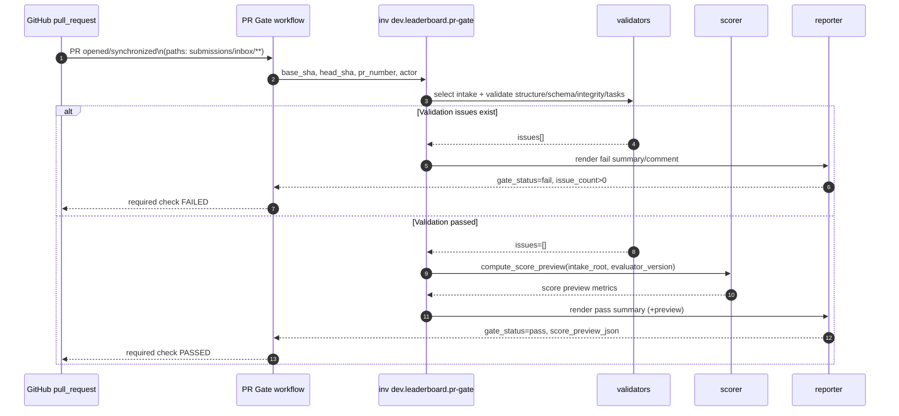

# Lane C PR Gate Implementation Plan (Code-Level)

This is the executable design for Lane C (`.wip/lane-c-pr-gate.md`) using the approved architecture in `.wip/leaderboard-alignment-plan.md`.

## Scope

- Trigger on PRs to `leaderboard-submissions` that touch `submissions/inbox/**`.
- Enforce read-only execution boundaries.
- Validate intake structure + manifest integrity + task invariants.
- Compute deterministic score preview using pinned evaluator version.
- Publish clear diagnostics in check summary (and optional PR comment).

## Non-goals

- No canonical record writes (`submissions/<submission_id>.json`).
- No leaderboard file writes.
- No Hugging Face writes.
- No branch mutation.

## Proposed files and signatures

### 1) New workflow

` .github/workflows/leaderboard-pr-gate.yml `

```yaml
name: Leaderboard PR Gate

on:
  pull_request:
    branches: [leaderboard-submissions]
    paths:
      - "submissions/inbox/**"

permissions:
  contents: read
  pull-requests: write

jobs:
  pr-gate:
    name: Leaderboard PR Gate
    runs-on: ubuntu-latest
```

Notes:
- Keep job name stable for required-check policy (Lane A / A04).
- `pull-requests: write` is only for comment updates; if comments are removed, downgrade to read-only.

### 2) Intake contract models (Lane B consumption)

`src/webarena_verified/types/leaderboard/intake_payload.py`

```python
from enum import StrEnum

from pydantic import BaseModel, Field, ConfigDict


class IntakeLeaderboard(StrEnum):
    HARD = "hard"
    FULL = "full"
    BOTH = "both"

class IntakeSubmission(BaseModel):
    model_config = ConfigDict(extra="forbid")
    name: str = Field(min_length=1)
    leaderboard: IntakeLeaderboard
    reference: str = Field(min_length=1)
    created_at_utc: str
    packaging_summary: dict
    version: str | None = None
    contact_info: str | None = None

class IntakeManifestFile(BaseModel):
    path: str = Field(min_length=1)
    sha256: str
    size_bytes: int = Field(ge=0)

class IntakeManifest(BaseModel):
    model_config = ConfigDict(extra="forbid")
    created_at_utc: str
    schema_version: str
    files: list[IntakeManifestFile]
```

### 3) PR Gate runtime models

`dev/leaderboard/pr_gate/models.py`

```python
from pathlib import Path

from pydantic import BaseModel, ConfigDict


class PRGateContext(BaseModel):
    model_config = ConfigDict(extra="forbid", frozen=True)
    repo_root: Path
    base_sha: str
    head_sha: str
    pr_number: int
    pr_url: str
    actor: str
    summary_path: Path | None
    github_output_path: Path | None


class IntakeSelection(BaseModel):
    model_config = ConfigDict(extra="forbid", frozen=True)
    intake_id: str
    intake_root: Path
    changed_paths: list[str]


class ValidationIssue(BaseModel):
    model_config = ConfigDict(extra="forbid", frozen=True)
    code: str
    path: str
    message: str
    hint: str | None = None


class ScorePreview(BaseModel):
    model_config = ConfigDict(extra="forbid", frozen=True)
    evaluator_version: str
    overall_score: float
    success_count: int
    failure_count: int
    error_count: int
    missing_count: int


class PRGateResult(BaseModel):
    model_config = ConfigDict(extra="forbid", frozen=True)
    intake: IntakeSelection
    issues: list[ValidationIssue]
    score_preview: ScorePreview | None
```

### 4) Diff + intake selection

`dev/leaderboard/pr_gate/diff_selection.py`

```python
from pathlib import Path

def list_changed_paths(base_sha: str, head_sha: str, repo_root: Path) -> list[str]: ...

def select_single_intake(changed_paths: list[str], inbox_prefix: str = "submissions/inbox/") -> IntakeSelection: ...
```

Responsibilities:
- Build changed path set from git diff.
- Enforce "exactly one intake folder per PR".
- Reject paths outside `submissions/inbox/<intake_id>/**`.

### 5) Validators

`dev/leaderboard/pr_gate/validators.py`

```python
from pathlib import Path

def validate_required_layout(intake_root: Path) -> list[ValidationIssue]: ...
def validate_submission_schema(submission_file: Path) -> list[ValidationIssue]: ...
def validate_manifest_schema(manifest_file: Path) -> list[ValidationIssue]: ...
def validate_manifest_integrity(intake_root: Path, manifest_file: Path) -> list[ValidationIssue]: ...
def validate_task_invariants(tasks_root: Path) -> list[ValidationIssue]: ...
```

Rules:
- Required files: `submission.json`, `manifest.json`, `tasks/**`.
- Manifest checks: recompute `sha256` and `size_bytes` for each declared file.
- Path safety: block absolute paths and traversal (`..`) from manifest entries.
- Task XOR: `.missing` xor (`agent_response.json` + `network.har`) per task directory.

### 6) Score preview adapter

`dev/leaderboard/pr_gate/scoring.py`

```python
from pathlib import Path

def compute_score_preview(
    intake_root: Path,
    evaluator_version: str,
    *,
    timeout_seconds: int = 900,
) -> ScorePreview: ...
```

Behavior:
- Uses pinned evaluator version from workflow env (`LEADERBOARD_EVALUATOR_VERSION`).
- Deterministic task ordering (numeric ascending task id).
- Returns summary only (no canonical writes).
- Raises a typed gate error if scoring toolchain fails.

### 7) Reporting

`dev/leaderboard/pr_gate/reporting.py`

```python
def render_summary_markdown(result: PRGateResult) -> str: ...
def render_failure_comment(result: PRGateResult) -> str: ...
def write_step_summary(markdown: str, summary_path: str | None) -> None: ...
def write_github_outputs(result: PRGateResult, github_output_path: str | None) -> None: ...
```

Output contract:
- `gate_status=pass|fail`
- `issue_count=<int>`
- `intake_id=<str>`
- `score_preview_json=<json>` (when available)

### 8) Orchestration entrypoint

`dev/leaderboard/pr_gate/run.py`

```python
def run_pr_gate(context: PRGateContext) -> int: ...
```

Execution order:
1. changed-path selection
2. structure/schema/integrity/task validations
3. score preview (only if validations pass)
4. summary + outputs write
5. exit code (`0` pass, `1` fail)

### 9) Invoke task wiring

`dev/leaderboard_tasks.py`

```python
@task(name="pr-gate")
def pr_gate(
    _ctx,
    base_sha: str,
    head_sha: str,
    pr_number: int,
    pr_url: str = "",
    actor: str = "",
    summary_path: str = "",
    github_output_path: str = "",
) -> None: ...
```

## Interaction diagram (modules)

```mermaid
flowchart LR
  WF[GitHub Workflow\nleaderboard-pr-gate.yml] --> INV[Invoke task\ndev.leaderboard.pr-gate]
  INV --> RUN[run_pr_gate(context)]

  RUN --> DIFF[list_changed_paths + select_single_intake]
  RUN --> VAL[validators.py]
  RUN --> SCORE[scoring.py]
  RUN --> REP[reporting.py]

  VAL --> TYPES[src/.../intake_payload.py]
  SCORE --> EVAL[webarena_verified evaluator\npinned version]

  REP --> SUM[$GITHUB_STEP_SUMMARY]
  REP --> OUT[$GITHUB_OUTPUT]
  OUT --> CHECK[Required check result]
```

## Runtime sequence (single PR)



## Failure taxonomy (for actionable diagnostics)

- `C03_LAYOUT_MISSING_FILE`: missing `submission.json` / `manifest.json`.
- `C03_LAYOUT_MULTIPLE_INTAKES`: PR modifies >1 intake folder.
- `C04_MANIFEST_PATH_ESCAPE`: manifest path traverses outside intake root.
- `C04_MANIFEST_HASH_MISMATCH`: sha256 mismatch on declared file.
- `C04_MANIFEST_SIZE_MISMATCH`: size mismatch on declared file.
- `C05_TASK_XOR_VIOLATION`: `.missing` and output files coexist or neither set.
- `C06_SCORE_PREVIEW_ERROR`: scoring tool failure/timeouts/version mismatch.

Every issue should include `code`, `path`, `message`, and `hint`.

## Detailed rollout by Lane C tasks

### C01 Trigger

1. Add workflow with branch/path filters.
2. Ensure check/job name is stable: `Leaderboard PR Gate`.
3. Add concurrency for duplicate `synchronize` events:
   - `group: pr-gate-${{ github.event.pull_request.number }}`
   - `cancel-in-progress: true`

### C02 Read-only enforcement

1. Set least-privilege permissions.
2. Checkout with `persist-credentials: false`.
3. Block mutating commands in code review checklist (`git add/commit/push`, HF upload APIs).

### C03-C05 Validations

1. Implement selection + validators.
2. Add deterministic issue ordering (sort by `path`, then `code`).
3. Short-circuit scoring when `issues != []`.

### C06 Score preview

1. Pin evaluator version via workflow env.
2. Use deterministic task traversal and fixed JSON serialization for output.
3. Include preview metrics in summary table.

### C07 Diagnostics

1. Standard markdown template for pass/fail.
2. One-line remediation hint per issue.
3. Include intake id and PR number in heading for supportability.

## Test plan

### Unit tests

`tests/leaderboard/test_pr_gate_selection.py`
- no changed files -> fail
- path outside inbox -> fail
- two intake ids in one diff -> fail

`tests/leaderboard/test_pr_gate_manifest.py`
- valid manifest hash/size -> pass
- hash mismatch -> deterministic fail code/path
- path traversal entry -> fail

`tests/leaderboard/test_pr_gate_tasks.py`
- `.missing` only -> pass
- pair (`agent_response.json`,`network.har`) only -> pass
- both modes together -> fail
- partial pair missing one file -> fail

`tests/leaderboard/test_pr_gate_reporting.py`
- summary includes issue table
- outputs include `gate_status`, `issue_count`, `intake_id`

### Workflow smoke tests

- PR fixture with valid intake passes.
- PR fixture with manifest mismatch fails and exposes path-specific message.
- Check remains required-check compatible after reruns/synchronize events.

## Acceptance criteria

- C1: Only `submissions/inbox/<intake_id>/**` is accepted input scope.
- C2: PR Gate never mutates repository or HF state.
- C3: Manifest integrity checks are deterministic and path-safe.
- C4: Task invariants enforce `.missing` xor outputs.
- C5: Score preview is produced on valid payloads using pinned evaluator version.
- C6: Failure output is actionable and path-specific.
