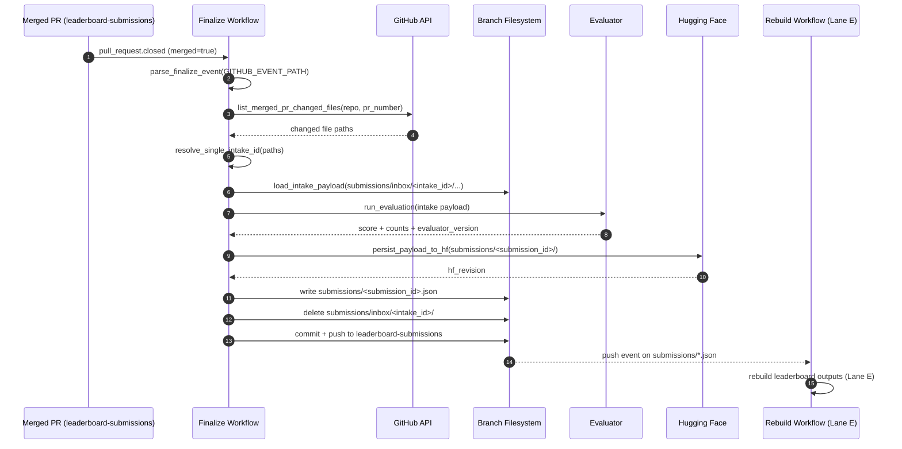
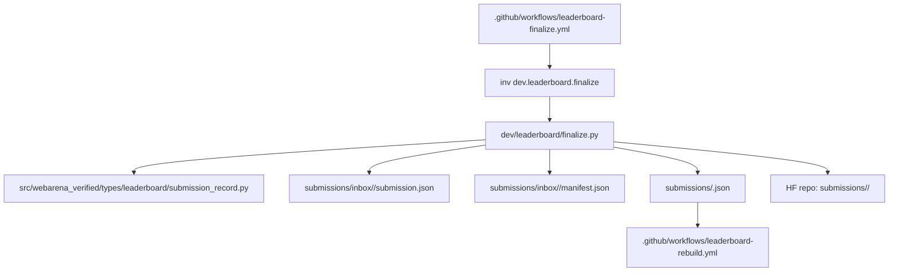

# Lane D - Finalize Workflow (Post-merge)

## Goal

After merge, canonicalize one intake submission, upload canonical payload to HF, write `submissions/<submission_id>.json`, and clean `submissions/inbox/<intake_id>/`.

This lane uses a **push-triggered handoff** to Lane E: rebuild runs when finalize commits canonical record changes.

## Scope and non-goals

- In scope: merged PR finalization on `leaderboard-submissions`.
- In scope: one canonical record per merged intake PR.
- In scope: deterministic `submission_id = github_pr_number`.
- Out of scope: leaderboard file generation (owned by Lane E).
- Out of scope: policy/ruleset enforcement (owned by Lane A).

## Workflow design

### D01 Finalize trigger

Create `.github/workflows/leaderboard-finalize.yml`.

- Trigger:
  - `on.pull_request.types: [closed]`
  - `on.pull_request.branches: [leaderboard-submissions]`
- Job guard:
  - `if: github.event.pull_request.merged == true`
- Permissions:
  - `contents: write`
- Concurrency:
  - `group: leaderboard-finalize-${{ github.event.pull_request.number }}`
  - `cancel-in-progress: false`

### D07 Rebuild trigger by push (selected)

Lane E workflow listens to push updates written by finalize.

- `on.push.branches: [leaderboard-submissions]`
- `on.push.paths:`
  - `submissions/*.json`

This keeps coupling simple and avoids dispatch permissions.

## Module plan and function signatures

Add `dev/leaderboard/finalize.py` as the finalize entrypoint.

```python
from pathlib import Path
from pydantic import BaseModel

class FinalizeContext(BaseModel):
    pr_number: int
    pr_url: str
    merge_commit_sha: str
    source_repository_id: int
    source_repository_full_name: str
    github_pr_author_id: int
    github_pr_author_login: str

class HFPersistResult(BaseModel):
    hf_repo: str
    hf_path: str
    hf_revision: str

class FinalizeResult(BaseModel):
    submission_id: str
    intake_id: str
    canonical_record_path: str
    deleted_inbox_path: str
    hf_repo: str
    hf_path: str
    hf_revision: str

def parse_finalize_event(event_path: Path) -> FinalizeContext: ...
def list_merged_pr_changed_files(repo: str, pr_number: int, token: str) -> list[str]: ...
def resolve_single_intake_id(changed_files: list[str]) -> str: ...
def load_intake_payload(repo_root: Path, intake_id: str) -> tuple[dict, dict]: ...
def run_evaluation(repo_root: Path, intake_id: str, evaluator_version: str) -> dict: ...
def persist_payload_to_hf(*, repo_root: Path, intake_id: str, submission_id: str, hf_repo: str, hf_token: str) -> HFPersistResult: ...
def build_canonical_record(*, context: FinalizeContext, submission_id: str, intake_submission: dict, eval_summary: dict, hf_result: HFPersistResult, now_utc: str) -> dict: ...
def write_canonical_record(*, repo_root: Path, submission_id: str, record: dict) -> Path: ...
def delete_inbox_folder(*, repo_root: Path, intake_id: str) -> Path: ...
def finalize_submission(*, repo_root: Path, event_path: Path, github_repo: str, github_token: str, hf_repo: str, hf_token: str, evaluator_version: str) -> FinalizeResult: ...
```

Add invoke task in `dev/leaderboard_tasks.py`:

```python
@task(name="finalize")
def finalize_task(
    _ctx: Context,
    event_path: str,
    github_repo: str,
    hf_repo: str,
    github_token: str = "",
    hf_token: str = "",
    evaluator_version: str = "",
) -> None: ...
```

## Canonical record contract (D05)

Write to `submissions/<submission_id>.json` with required fields:

- identity: `submission_id`, `github_pr_number`, `github_pr_url`
- provenance:
  - `source_repository_id`
  - `source_repository_full_name`
  - `github_pr_author_id`
  - `github_pr_author_login`
- state/timing:
  - `status` (accepted)
  - `eval_completed_at_utc`
  - `evaluator_version`
- HF pointers:
  - `hf_repo`
  - `hf_path`
  - `hf_revision`
- metrics:
  - `overall_score`
  - `shopping_score`, `reddit_score`, `gitlab_score`, `wikipedia_score`, `map_score`, `shopping_admin_score`
  - `success_count`, `failure_count`, `error_count`, `missing_count`

## End-to-end interactions



## File and component interactions



## Error handling policy

- Fail closed on any of:
  - missing/ambiguous intake folder
  - event payload missing provenance fields
  - HF upload failure
  - canonical schema validation failure
  - inbox delete failure
- Do not write partial canonical state:
  - if HF upload succeeds but canonical write fails, fail job and keep inbox untouched.
  - if canonical write succeeds but inbox delete fails, fail job and keep record for manual reconciliation.
- Emit actionable step summary with:
  - `pr_number`, `submission_id`, `intake_id`, `hf_path`, `hf_revision`, error root cause.

## Testing plan

- Unit tests: `tests/leaderboard/test_finalize.py`
  - event parsing
  - `submission_id == pr_number`
  - intake id extraction from changed files
  - canonical record shape and required fields
  - failure paths (no intake, multiple intake folders, HF failure)
- Type tests: extend `tests/types/test_leaderboard_types.py`
  - canonical record required provenance and score fields
- Workflow smoke:
  - merged PR fixture -> finalize writes canonical file + deletes inbox
  - push on `submissions/*.json` triggers Lane E

## Task checklist

- [ ] D01 Implement finalize trigger (`deps: A04,C01`)
- [ ] D02 Canonical ID assignment (`deps: D01`)
- [ ] D03 Capture provenance fields from PR event (`deps: D01,B04`)
- [ ] D04 Upload canonical payload to HF (`deps: D02`)
- [ ] D05 Write canonical record (`deps: D02,D03,D04,B04`)
- [ ] D06 Remove merged intake folder (`deps: D05`)
- [ ] D07 Trigger rebuild workflow via push path (`deps: D06`)

## Outputs

- Canonical records produced from merged intake PRs
- Inbox cleaned after successful finalization
- Lane E triggered by push changes on `submissions/*.json`
