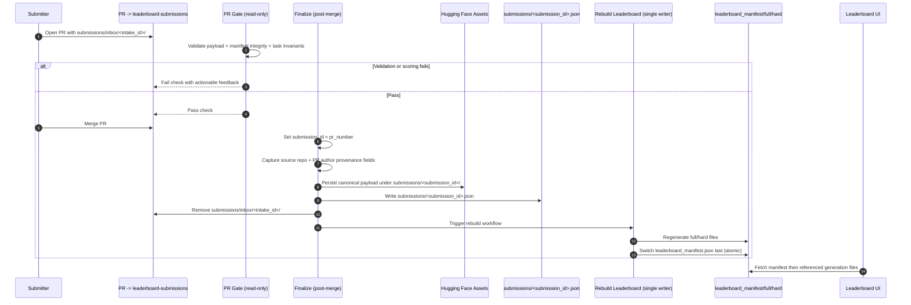

# Leaderboard Alignment and Certification Plan (Approved Architecture)

This document is the implementation-ready plan for the simplified model.

## Final decisions

- Intake surface is GitHub PRs targeting `leaderboard-submissions`.
- User payload path is unique per submission attempt: `submissions/inbox/<intake_id>/...`.
- User does not provide canonical `submission_id`.
- CI sets canonical `submission_id = <pr_number>`.
- Intake PRs are fork-only by repository policy/ruleset (not by workflow code check).
- Canonical submission record is `submissions/<submission_id>.json`.
- Canonical submission record keeps provenance fields from PR event metadata.
- Leaderboard outputs are:
  - `leaderboard_full.<generation_id>.json`
  - `leaderboard_hard.<generation_id>.json`
  - `leaderboard_manifest.json`
- Leaderboard data source is `leaderboard-submissions` branch (not `gh-pages`).
- `gh-pages` is docs-only.
- Evaluator version is pinned in CI YAML.
- No file-size/count rejection limits; keep runtime guardrails only.

---

## Branch roles

- `main`: code/specs only.
- `leaderboard-submissions`: inbox payloads, canonical submission records, leaderboard data files.
- `gh-pages`: docs site only.

---

## Storage model on `leaderboard-submissions`

```text
submissions/
  inbox/
    <intake_id>/
      submission.json
      manifest.json
      tasks/
        <task_id>/
          agent_response.json
          network.har
        <task_id>/
          .missing
  <submission_id>.json

leaderboard_full.<generation_id>.json
leaderboard_hard.<generation_id>.json
leaderboard_manifest.json
```

Notes:

- `submissions/inbox/<intake_id>/` is temporary intake state.
- CI removes merged intake folder after finalization.
- `submissions/<submission_id>.json` is canonical accepted submission state.

---

## Workflow model (single pipeline, secure boundaries)

### 1) PR Gate workflow (`pull_request` on `leaderboard-submissions`)

- Purpose: validate payload and compute score preview.
- Permissions: read-only; no HF write; no branch mutation.
- Input: `submissions/inbox/<intake_id>/...`.
- Validations:
  - contract structure,
  - manifest integrity (recomputed hashes/sizes),
  - task folder invariants.
- Output:
  - pass/fail check + actionable PR comment,
  - scoring result for maintainers to review.

### 2) Finalize workflow (post-merge on `leaderboard-submissions`)

- Trigger: merged submission PR.
- Actions:
  1. read `pr_number` from GitHub event,
  2. set `submission_id = pr_number`,
  3. capture provenance fields from PR event metadata,
  4. upload canonical payload snapshot to HF at `submissions/<submission_id>/`,
  5. write `submissions/<submission_id>.json`,
  6. remove merged `submissions/inbox/<intake_id>/`.
- Does not write leaderboard files directly.

### 3) Rebuild Leaderboard workflow (single writer)

- Trigger: finalize success (or explicit dispatch).
- Single writer for:
  - `leaderboard_full.<generation_id>.json`,
  - `leaderboard_hard.<generation_id>.json`,
  - `leaderboard_manifest.json`.
- Concurrency:
  - `concurrency.group: leaderboard-data-writer`
  - `cancel-in-progress: false`

---

## Submission contracts

### Intake payload (`submissions/inbox/<intake_id>/submission.json`)

Required fields:

- `name`
- `leaderboard`
- `reference`
- `created_at_utc`
- `packaging_summary`

Optional fields:

- `version`
- `contact_info`

### Intake manifest (`submissions/inbox/<intake_id>/manifest.json`)

Required fields:

- `created_at_utc`
- `schema_version`
- `files[]` with:
  - `path`
  - `sha256`
  - `size_bytes`

### Canonical submission record (`submissions/<submission_id>.json`)

This record represents accepted canonical state and includes:

- `submission_id`
- `github_pr_number`
- `github_pr_url`
- `source_repository_id` (from `pull_request.head.repo.id`)
- `source_repository_full_name` (from `pull_request.head.repo.full_name`)
- `github_pr_author_id` (from `pull_request.user.id`)
- `github_pr_author_login` (from `pull_request.user.login`)
- `status` (always `accepted` in canonical records)
- `eval_completed_at_utc`
- `evaluator_version`
- `hf_repo`
- `hf_path`
- `hf_revision`
- scoring fields:
  - `overall_score`
  - `shopping_score`, `reddit_score`, `gitlab_score`, `wikipedia_score`, `map_score`, `shopping_admin_score`
  - `success_count`, `failure_count`, `error_count`, `missing_count`

---

## End-to-end flow



---

## Retention and pruning (separate from gate)

- Retention is enforced in the Rebuild Leaderboard workflow.
- Keep latest 100 canonical records from `submissions/*.json`.
- "Latest" sort rule:
  1. `eval_completed_at_utc` descending,
  2. `submission_id` descending (tie-breaker).
- After pruning, rebuild leaderboard files from retained accepted records only.

---

## Caching and freshness

- Generation files are immutable by filename:
  - `leaderboard_full.<generation_id>.json`
  - `leaderboard_hard.<generation_id>.json`
- `leaderboard_manifest.json` is mutable pointer to latest generation.
- Publish order in rebuild workflow:
  1. write generation files,
  2. update manifest last.
- UI data loading:
  - manifest revalidate aggressively (`no-store`/revalidate),
  - generation files cache aggressively.

This guarantees either old-consistent or new-consistent reads.

---

## UI data source contract

- `MANIFEST_URL` is set from build-time environment only (not user/UI editable at runtime).
- Use `PUBLIC_LEADERBOARD_MANIFEST_URL` as the source of truth for production.
- Production `PUBLIC_LEADERBOARD_MANIFEST_URL` points to `leaderboard-submissions` branch-hosted manifest URL.
- No leaderboard-data dependency on docs `gh-pages` deploy.

---

## Branch protection note

Update branch protection/ruleset for `leaderboard-submissions` to force the intake model:

- require pull requests (no direct pushes),
- require PR Gate status check to pass before merge,
- require Rebuild workflow check if it is configured as required,
- enforce fork-only intake in repository policy/ruleset (no workflow code-level fork check).

---

## Operational guardrails (without file limits)

- No payload rejection by file count/size.
- Keep runtime safeguards:
  - workflow timeout,
  - retry policy for transient failures,
  - explicit failure comments with root cause.
- Keep trusted execution boundary:
  - run validator/scorer code from trusted branch source,
  - treat PR payload as data only.

---

## Certification gates

1. Valid intake payload passes gate; invalid payload fails with actionable messages.
2. Canonical identity is deterministic: `submission_id == pr_number`.
3. HF snapshot exists at `submissions/<submission_id>/`.
4. Canonical record exists at `submissions/<submission_id>.json` with evaluator version, scores, and provenance fields.
5. Rebuild workflow is the only writer of leaderboard files.
6. Retention enforces exactly 100 canonical submission records in branch tip.
7. Manifest switches only after generation files are present.
8. Leaderboard refresh does not require/retrigger docs publish.
9. Fork-only intake is enforced by repository policy/ruleset.

---

## Non-negotiable rules

- One intake surface: PRs to `leaderboard-submissions`.
- One canonical ID rule: `submission_id = <pr_number>`.
- One fork-only intake rule enforced at repository policy/ruleset level.
- One user-editable intake path format: `submissions/inbox/<intake_id>/**`.
- One canonical record per accepted submission: `submissions/<submission_id>.json`.
- Canonical record includes source repository and PR author provenance fields.
- One writer for leaderboard outputs: Rebuild Leaderboard workflow.
- One pinned evaluator package version in CI.
- No hidden fallback paths outside this architecture.
