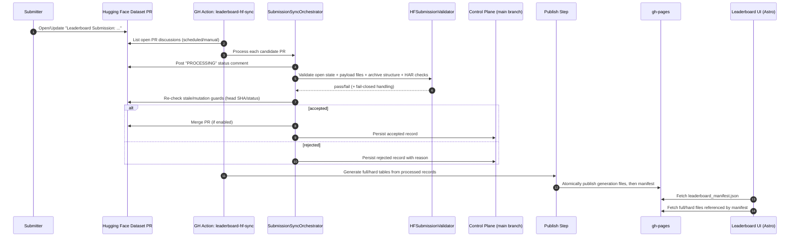
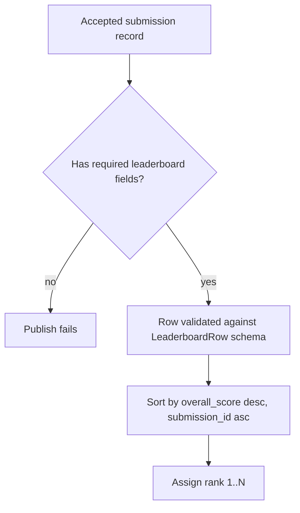

# Leaderboard Submission and Publish Flow (Current Branch Snapshot)

This document explains:

1. how leaderboard submissions start,
2. how scores are handled/calculated,
3. how leaderboard data is updated,
4. how the leaderboard web page is deployed.

It is based on the current implementation in `feature/add-leaderboard`.

---

## 1) How Submission Starts

There are two layers to understand:

- **Participant payload ingress**: Hugging Face (HF) dataset pull requests.
- **Control-plane + publish**: GitHub Actions + records in this repo + `gh-pages`.

### Current intended ingress model

The ingestion model is now **HF PR scheduled sync only**:

- `dev/leaderboard/README.md` says legacy GitHub submission-PR ingestion was removed.
- `leaderboard/spec/leaderboard_submission_spec.md` defines HF dataset PRs as payload source of truth.
- `.github/workflows/leaderboard-hf-sync.yml` runs every 6 hours and can run manually.

### What submitters provide

A submission is placed under:

- `submissions/accepted/<submission_id>/` in the HF dataset PR branch (`refs/pr/<id>`).

The branch currently shows two naming conventions in code/spec pages:

- Spec/page convention: `payload.tar.zst`, `payload.sha256`, `metadata.json`, `manifest.json`
- Validator convention in current `dev/leaderboard` code: `submission-payload.tar.gz`, `submission_metadata.json`

This is an in-flight migration area; maintainers should align these contracts.

---

## 2) End-to-End Processing Flow



---

## 3) Validation and State Machine

The orchestrator (`dev/leaderboard/submission_sync_orchestrator.py`) enforces:

- **Mutation guard**: once a PR is first seen with an initial head SHA, changed head can be auto-rejected.
- **Stale guard**: after validation, if PR status/SHA changed, reject as stale.
- **Status comments** on HF PR (`PROCESSING`, `PASS`, `FAILED`, etc.).
- **Terminal transitions** to accepted/rejected; transient/fail-closed errors can remain pending for retry.

Control records are written under status partitions (current dev pathing):

- `leaderboard/data/submissions/pending/*.json`
- `leaderboard/data/submissions/accepted/*.json`
- `leaderboard/data/submissions/rejected/*.json`

(Older specs mention a `processed/` directory; both patterns appear in this branch history/spec docs.)

---

## 4) How Scores Are Calculated

Important distinction:

### A) Evaluation score semantics (task-level)

`src/webarena_verified/types/eval.py` defines scoring behavior:

- A task is effectively binary:
  - `1.0` if all evaluators succeed
  - `0.0` otherwise
- Statuses: `success`, `failure`, `error`
- Summary counts are computed across tasks and per site.

### B) Leaderboard row fields (publish-time)

`dev/leaderboard/publish.py` expects accepted records to already contain fields like:

- `overall_score`
- per-site scores (`shopping_score`, `reddit_score`, etc.)
- counts (`success_count`, `failure_count`, `error_count`, `missing_count`)
- metadata (`name`, `checksum`, `webarena_verified_version`, ...)

### Key point

In current publish code, these leaderboard scores are **not recomputed during publish**; they are **read from accepted submission records** and validated for schema shape.

### Ranking logic

Rows are ranked deterministically by:

1. `overall_score` descending
2. `submission_id` ascending (tie-breaker)

Then rank indices are assigned starting at 1.



---

## 5) How Leaderboard Data Is Updated

There are two workflows involved:

### 1) Scheduled sync + publish pipeline

`.github/workflows/leaderboard-hf-sync.yml`:

- runs every 6h and on manual dispatch,
- runs HF sync processor (`inv dev.leaderboard.hf-sync`),
- commits control-plane changes to `main`,
- generates and publishes leaderboard JSON artifacts to `gh-pages` under `leaderboard/data/`.

### 2) Publish-only pipeline

`.github/workflows/leaderboard-publish.yml`:

- triggered by changes to processed submission data/dev leaderboard code or manual dispatch,
- regenerates full/hard generation files + manifest,
- commits/pushes updated `leaderboard/data/*` to `gh-pages`.

### Atomic publish contract

`dev/leaderboard/publish.py` and the runbook enforce:

1. stage files,
2. validate schema/hash,
3. copy generation assets first,
4. write/switch manifest last,
5. rollback-safe behavior on failure.

Smoke checks (`leaderboard-smoke.yml`) verify the live manifest and SHA integrity of referenced files.

---

## 6) How the Web Leaderboard Is Deployed

### Data deployment (implemented)

Leaderboard data is deployed to GitHub Pages (`gh-pages`) in:

- `leaderboard/data/leaderboard_manifest.json`
- `leaderboard/data/leaderboard_full.<generation_id>.json`
- `leaderboard/data/leaderboard_hard.<generation_id>.json`

### Frontend runtime behavior (implemented in site code)

The Astro app at `leaderboard/site`:

- uses base path `/webarena-verified/leaderboard/`,
- loads `data/leaderboard_manifest.json`,
- then fetches referenced full/hard files,
- renders tables client-side via Tabulator.

### Frontend CI deploy status (important)

In this branch snapshot, there is **no dedicated GitHub Action that builds/deploys `leaderboard/site`**.
The page spec (`leaderboard/spec/leaderboard_page_spec.md`) also lists site deploy workflow creation as TODO.
So data publishing to Pages is automated, while site artifact deployment appears pending/manual/not yet wired in CI.

---

## 7) ASCII UI Sketch (Current Site Structure)

```text
+----------------------------------------------------------------------------------+
| WebArena-Verified                              [Leaderboard] [Submission] [FAQ] |
+----------------------------------------------------------------------------------+
| KPI: Evaluator Version | Total Submissions | Last Submission                     |
+----------------------------------------------------------------------------------+
| [WebArena-Verified] [WebArena-Verified-Hard]     [Search................] [CSV] |
+----------------------------------------------------------------------------------+
| Rank | Name | GitLab | Reddit | Shopping Admin | Shopping | Wikipedia | Map ... |
|-------------------------------------------------------------------------------...|
| 1    | ...                                                                        |
| 2    | ...                                                                        |
+----------------------------------------------------------------------------------+
| Pagination controls                                                               |
+----------------------------------------------------------------------------------+
| Footer links: Documentation | GitHub | Contact                                   |
+----------------------------------------------------------------------------------+
```

---

## 8) Practical Maintainer Notes

- Keep submission file naming contracts aligned across validator constants, submission docs, and specs/types.
- Ensure accepted control records include complete leaderboard metrics before publish.
- Add a dedicated workflow for `leaderboard/site` build + deploy to fully automate webpage deployment.
