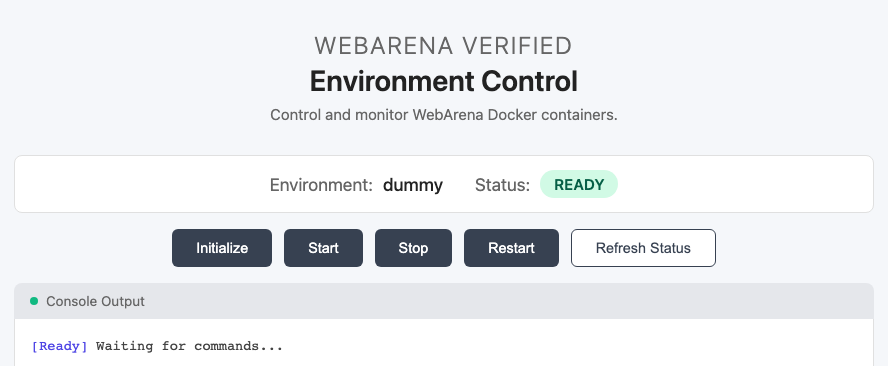

# WebArena-Verified

<p align="center">
  <a href="https://pypi.org/project/webarena-verified/"></a>
  <a href="https://github.com/ServiceNow/webarena-verified/pkgs/container/webarena-verified"></a>
  <a href="pyproject.toml"></a>
  <a href="tests"></a>
  <a href="https://servicenow.github.io/webarena-verified/"></a>
  <a href="https://huggingface.co/datasets/AmineHA/WebArena-Verified"></a>
</p>

WebArena-Verified is the verified release of the WebArena benchmark. It distributes a curated, version-controlled dataset of web tasks together with deterministic evaluators that operate on agent responses and captured network traces. The project is designed for reproducible benchmarking of web agents and provides tooling for both single-task debugging and batch evaluation.

<p align="center">
  <a href="https://servicenow.github.io/webarena-verified/">📖 Documentation</a>
</p>

## 📢 Announcements

- **February 2, 2026**: Optimized Docker images for all WebArena environments are now available on [Docker Hub](https://hub.docker.com/u/am1n3e)! Images are up to 92% smaller than originals, include auto-login headers, plus a single container for Map (beta) (previously 5 separate containers). See the [Environments documentation](https://servicenow.github.io/webarena-verified/environments/).
- **February 2, 2026**: WebArena-Verified is now available via Docker and uvx! Run `uvx webarena-verified --help` or `docker run ghcr.io/servicenow/webarena-verified:latest --help` to get started.
- **January 7, 2026**: WebArena-Verified is now available on PyPI! Install it easily with `pip install webarena-verified`.
- **December 2, 2025**: We are presenting WebArena-Verified at the [Scaling Environments for Agents (SEA) Workshop](https://sea-workshop.github.io/) at NeurIPS 2025 on December 7th in San Diego. Come see us!
- **November 12, 2024**: Started initial release with collaborators to gather early feedback, catch any issues, and clarify the documentation. **Public release scheduled for December 4th, 2025.**

## 🎯 Highlights

- **Fully audited benchmark**: Every task, reference answer, and evaluator has been manually reviewed and corrected
- **Offline evaluation**: Evaluate agent runs without requiring live web environments using network trace replay
- **Deterministic scoring**: Removed LLM-as-a-judge evaluation and substring matching in favor of type-aware normalization and structural comparison
- **WebArena-Verified Hard subset**: A difficulty-prioritized 258-task subset for cost-effective evaluation

## Usage

### uvx (no install)

```bash
uvx webarena-verified COMMAND [ARGS]
```

### pip / uv (project dependency)

```bash
# Setup (choose one)
pip install webarena-verified
# uv add webarena-verified

# Usage
webarena-verified COMMAND [ARGS]
# or (inside uv-managed project)
uv run webarena-verified COMMAND [ARGS]
```

### Docker

```bash
# Usage
docker run --rm ghcr.io/servicenow/webarena-verified:latest COMMAND [ARGS]
```

Example:

```bash
uvx webarena-verified eval-tasks --task-ids 108 --output-dir examples/agent_logs/demo
```

## Dataset

WebArena-Verified provides:

- Full dataset: the complete benchmark with all 812 verified tasks across supported sites.
- Hard subset: a difficulty-prioritized subset of 258 tasks for faster, lower-cost evaluation.

### Full dataset

```bash
# From the repo
cat assets/dataset/webarena-verified.json > webarena-verified.json

# From the CLI
webarena-verified dataset-get --output webarena-verified.json

# From Docker
docker run --rm \
  -v "$PWD:/data" \
  ghcr.io/servicenow/webarena-verified:latest \
  dataset-get --output /data/webarena-verified.json
```

From Hugging Face dataset:

```python
from datasets import load_dataset

dataset = load_dataset("AmineHA/WebArena-Verified", split="full")
```

### Hard subset

```bash
# From the CLI
webarena-verified subset-export --name webarena-verified-hard --output webarena-verified-hard.json

# From Docker
docker run --rm \
  -v "$PWD:/data" \
  ghcr.io/servicenow/webarena-verified:latest \
  subset-export --name webarena-verified-hard --output /data/webarena-verified-hard.json
```

From Hugging Face dataset:

```python
from datasets import load_dataset

dataset = load_dataset("AmineHA/WebArena-Verified", split="hard")
```

## 🌐 Environments

> Note: We have fixed multiple known issues in several environments. See the [Environments documentation](https://servicenow.github.io/webarena-verified/environments/) for details on fixes and current behavior.

### Start and Stop Sites

Run sites with the built-in CLI, or run site containers directly with Docker.

```bash
# CLI
webarena-verified env start --site <site>  # sites: shopping, shopping_admin, reddit, gitlab, wikipedia, map
webarena-verified env setup init --site wikipedia --data-dir ./downloads  # data download required
webarena-verified env start --site wikipedia --data-dir ./downloads
webarena-verified env setup init --site map --data-dir ./downloads  # data download required
webarena-verified env start --site map
webarena-verified env stop --site <site>
webarena-verified env stop-all

# Docker
docker run -d --name webarena-verified-shopping -p 7770:80 -p 7771:8877 am1n3e/webarena-verified-shopping
docker run -d --name webarena-verified-shopping_admin -p 7780:80 -p 7781:8877 am1n3e/webarena-verified-shopping_admin
docker run -d --name webarena-verified-reddit -p 9999:80 -p 9998:8877 am1n3e/webarena-verified-reddit
docker run -d --name webarena-verified-gitlab -p 8023:8023 -p 8024:8877 am1n3e/webarena-verified-gitlab

# Wikipedia: requires --data-dir setup and a mounted data volume
docker run -d --name webarena-verified-wikipedia \
  -p 8888:8080 -p 8889:8874 \
  -v /path/to/downloads:/data:ro \
  am1n3e/webarena-verified-wikipedia

# Map: run setup first (webarena-verified env setup init --site map --data-dir ./downloads)
docker run -d --name webarena-verified-map \
  -p 3030:3000 -p 3031:8877 \
  -v webarena-verified-map-tile-db:/data/database \
  -v webarena-verified-map-routing-car:/data/routing/car \
  -v webarena-verified-map-routing-bike:/data/routing/bike \
  -v webarena-verified-map-routing-foot:/data/routing/foot \
  -v webarena-verified-map-nominatim-db:/data/nominatim/postgres \
  -v webarena-verified-map-nominatim-flatnode:/data/nominatim/flatnode \
  -v webarena-verified-map-website-db:/var/lib/postgresql/14/main \
  -v webarena-verified-map-tiles:/data/tiles \
  -v webarena-verified-map-style:/data/style \
  am1n3e/webarena-verified-map
```

### Environment Control

Check status and initialize environments via env-ctrl using CLI or HTTP API.

```bash
# CLI (inside a running site container)
docker exec <container> env-ctrl status
docker exec <container> env-ctrl init

# HTTP
curl http://localhost:8877/status
curl -X POST http://localhost:8877/init
```

<p align="center">
  
</p>

See the [Environments documentation](https://servicenow.github.io/webarena-verified/environments/) and [Environment Control docs](https://servicenow.github.io/webarena-verified/environments/environment_control/) for site-specific Docker commands, ports, and credentials.

## 🧪 Evaluate A Task

Evaluate a task using the CLI or programmatically:

**CLI:**
```bash
webarena-verified eval-tasks \
  --task-ids 108 \
  --output-dir examples/agent_logs/demo \
  --config examples/configs/config.example.json
```

**Library:**

Start by creating a `WebArenaVerified` instance with your environment configuration:

```python
from pathlib import Path
from webarena_verified.api import WebArenaVerified
from webarena_verified.types.config import WebArenaVerifiedConfig

# Initialize with configuration
config = WebArenaVerifiedConfig(
    environments={
        "__GITLAB__": {
            "urls": ["http://localhost:8012"],
            "credentials": {"username": "root", "password": "demopass"}
        }
    }
)
wa = WebArenaVerified(config=config)

# Get a single task
task = wa.get_task(44)
print(f"Task intent: {task.intent}")
```

Once you have your agent's output, evaluate it against the task definition:

**With Files:**
```python
# Evaluate a task with file paths
result = wa.evaluate_task(
    task_id=44,
    agent_response=Path("output/44/agent_response_44.json"),
    network_trace=Path("output/44/network_44.har")
)

print(f"Score: {result.score}, Status: {result.status}")
```

**With Inline Response:**
```python
# Evaluate a task with inline response
result = wa.evaluate_task(
    task_id=44,
    agent_response={
        "task_type": "NAVIGATE",
        "status": "SUCCESS",
        "retrieved_data": None
    },
    network_trace=Path("output/44/network_44.har")
)

print(f"Score: {result.score}, Status: {result.status}")
```

See the [Quick Start Guide](https://servicenow.github.io/webarena-verified/) for a complete walkthrough using example task logs.

## 📊 Dataset

- WebArena Verified dataset is in `assets/dataset/webarena-verified.json`
- The original WebArena dataset is in `assets/dataset/test.raw.json` (kept for reference)
- The WebArena Verified Hard subset task IDs are in `assets/dataset/subsets/webarena-verified-hard.json`

To export the hard subset's task data:

```bash
webarena-verified subset-export --name webarena-verified-hard --output webarena-verified-hard.json
```

See the [documentation](https://servicenow.github.io/webarena-verified/) for more info.

## 🤝 Contributing

We welcome improvements to both the dataset and the evaluation tooling. See the [Contributing Guide](CONTRIBUTING.md) for guidelines, local development tips, and dataset update workflows.

## 📄 Citation

If you use WebArena-Verified in your research, please cite our paper:

```bibtex
@inproceedings{
hattami2025webarena,
title={WebArena Verified: Reliable Evaluation for Web Agents},
author={Amine El hattami and Megh Thakkar and Nicolas Chapados and Christopher Pal},
booktitle={Workshop on Scaling Environments for Agents},
year={2025},
url={https://openreview.net/forum?id=94tlGxmqkN}
}
```

## 🙏 Acknowledgements

We thank [Prof. Shuyan Zhou](https://scholars.duke.edu/person/shuyan.zhou) and [Prof. Graham Neubig](https://miis.cs.cmu.edu/people/222215657/graham-neubig) for their valuable guidance and feedback.
