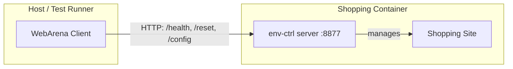

# Environment Control

A lightweight utility for WebArena test environment containers that enables self-contained environment management.

## Why?

Without this package, setting up a test environment requires:

1. Starting the Docker container
2. Using `docker exec` to run setup commands (e.g., configuring external URLs)

This approach has two main issues:

1. **Version mismatch** - Setup commands may change between versions, requiring maintenance of different setup scripts for different environment versions.
2. **Limited container access** - In some deployment scenarios (e.g., Kubernetes, managed container services), accessing the internal Docker daemon or running `docker exec` is either not allowed or difficult to configure.

## How It Works

The package is installed inside each test environment container and exposes environment management operations through two interfaces:

- **CLI** - For direct access via `docker exec`
- **HTTP API** - For remote access without requiring Docker access

This makes each test environment site fully self-contained and provides a consistent interface across all test environments (shopping, reddit, gitlab, etc.), regardless of their underlying implementation.

## Architecture



The client library communicates with `env-ctrl` running inside each container, allowing operations like health checks, resets, and configuration changes without direct Docker access.

## Usage

### Via Docker Exec (CLI)

When you have Docker access, you can use the CLI directly:

```bash
# List available environment types
docker exec <container> env-ctrl list

# Check status
docker exec <container> env-ctrl status

# Start the HTTP server
docker exec <container> env-ctrl serve --port 8877
```

### Via HTTP API

When the server is running, interact with it over HTTP:

```bash
curl http://localhost:8877/health
curl -X POST http://localhost:8877/reset
```

### Python Client

For programmatic access, use the client classes from the `webarena_verified` library:

```python
from webarena_verified.environments.env_ctrl_client import HttpClient

# Connect to the env-ctrl server
client = HttpClient(base_url="http://localhost:8877")

# Check environment status
result = client.status()
print(result["success"])  # True if healthy

# Wait for environment to be ready
result = client.wait_until_ready(timeout=60.0)

# Start/stop the environment
client.start(wait=True)
client.stop()
```

**Available methods:**

| Method | Description |
|--------|-------------|
| `status()` | Get environment health status |
| `init()` | Initialize the environment |
| `start(wait=False)` | Start the environment |
| `stop()` | Stop the environment |
| `restart(wait=False)` | Restart the environment |
| `wait_until_ready(timeout, interval)` | Poll until environment is ready |
| `cleanup()` | Remove logs, caches, temp files |
| `config()` | Get build configuration |

**Alternative: Docker client**

If you have Docker access and prefer to use `docker exec` instead of HTTP:

```python
from webarena_verified.environments.env_ctrl_client import EnvCtrlDockerClient

client = EnvCtrlDockerClient(container_name="shopping-slim")
result = client.status()
```
