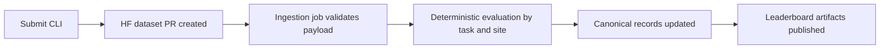

# Submitting Results

This guide shows the full submission flow from run outputs to leaderboard ingestion.

## Prerequisites

Your run output should contain task folders in this shape:

```text
<run_output_dir>/
  <task_id>/
    agent_response.json
    network.har
```

You can submit partial coverage. Missing or invalid tasks are tracked in the package summary.

## Step 1 - Create Submission Package

```bash
uvx webarena-verified create-submission-pkg \
  --run-output-dir ./output \
  --output ./submissions
```

If you prefer, you can run the same CLI through a local install, `uv run`, or Docker.

Expected result: a folder like `./submissions/webarena-verified-submission-YYYYMMDD_HHMMSS/` with task folders and `summary.json`.

## Step 2 - Review `summary.json`

Open `summary.json` and check `packaging_summary` plus `issues`.

Common issue categories:

| Category | Meaning |
|---|---|
| `missing_agent_response_only` | Task is missing `agent_response.json` |
| `missing_network_har_only` | Task is missing `network.har` |
| `missing_both_files` | Both required files are missing |
| `invalid_har_files` | HAR exists but cannot be processed |
| `empty_agent_response` | Agent response file exists but is empty |

!!! tip
    Fix issues before submitting when possible. Higher-quality packages reduce ingestion failures and improve evaluation coverage.

## Step 3 - Submit To Leaderboard

```bash
uvx webarena-verified submit \
  --submission-dir ./submissions/my-submission \
  --name "TeamX/ModelY" \
  --leaderboard both \
  --reference "https://example.com/paper"
```

What this command does:

1. Validates the package.
2. Generates `submission.json` and `manifest.json`.
3. Uploads the payload to HuggingFace and creates a dataset PR.

Expected output includes the HuggingFace PR URL, for example:

```text
PR URL: https://huggingface.co/datasets/<org>/<repo>/discussions/<N>
```

!!! info "Authentication"
    The `submit` command requires HuggingFace authentication. Use either method:

    ```bash
    # Option 1: Login via CLI (persistent)
    hf auth login

    # Option 2: Set token as environment variable
    export HF_TOKEN=hf_...
    ```

## What Happens Next

The automated ingestion pipeline runs every 30 minutes:



If your submission fails ingestion, review the PR payload and retry with a corrected package.
For support, open an issue in the WebArena-Verified repository.
