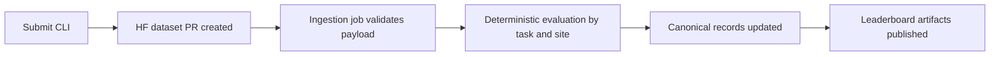

# Submitting Results

This guide shows the full submission flow from run outputs to leaderboard ingestion.

## Prerequisites

Your run output should contain task folders in this shape:

```text
<run_output_dir>/
  <task_id>/
    agent_response.json
    network.har
```

You can submit partial coverage. Package creation reports leaderboard coverage counts for valid, incomplete, and missing tasks.

## Step 1 - Create Submission Package

```bash
uvx webarena-verified create-submission-pkg \
  --run-output-dir ./output \
  --output ./my-submission \
  --leaderboard both
```

If you prefer, you can run the same CLI through a local install, `uv run`, or Docker.

The `--output` path is the submission package directory itself. If it already exists, the command will fail unless you pass `--force` to overwrite it.

Expected result: a `./my-submission/` folder containing task folders, `submission.json`, and `manifest.json`.

`create-submission-pkg` now embeds coverage stats in `submission.json` under `packaged_tasks`:

- `valid`: tasks with both required files
- `incomplete`: tasks with exactly one required file
- `missing`: tasks with no files or no task directory
- `expected`: total expected tasks for the leaderboard scope

## Step 2 - Edit `submission.json`

Open `submission.json` and replace the placeholder values for `name` and `reference`:

```json
{
  "name": "MySystem-v1",
  "leaderboard": "both",
  "reference": "https://example.com/paper",
  "version": null,
  "contact_info": null,
  "packaged_tasks": {
    "full": {
      "valid": 750,
      "incomplete": 12,
      "missing": 50,
      "expected": 812
    },
    "hard": {
      "valid": 230,
      "incomplete": 5,
      "missing": 23,
      "expected": 258
    }
  }
}
```

| Field | Required | Description |
|---|---|---|
| `name` | Yes | Submission name (e.g. `MySystem-v1`) |
| `leaderboard` | Yes | Auto-filled from `create-submission-pkg --leaderboard`; do not change unless you recreate the package |
| `reference` | Yes | HTTP(S) URL to paper or model reference |
| `version` | No | Model version identifier |
| `contact_info` | No | Contact email address |
| `packaged_tasks` | Yes | Auto-filled coverage summary; do not edit |

## Step 3 - Submit To Leaderboard

```bash
uvx webarena-verified submit \
  --submission-dir ./my-submission
```

What this command does:

1. Validates the package and reads your `submission.json`.
2. Regenerates `manifest.json` for integrity.
3. Uploads the payload to HuggingFace and creates a dataset PR.

Expected output includes the HuggingFace PR URL, for example:

```text
PR URL: https://huggingface.co/datasets/<org>/<repo>/discussions/<N>
```

!!! info "Authentication"
    The `submit` command requires HuggingFace authentication. Use either method:

    ```bash
    # Option 1: Login via CLI (persistent)
    hf auth login

    # Option 2: Set token as environment variable
    export HF_TOKEN=hf_...
    ```

## What Happens Next

The automated ingestion pipeline runs every 30 minutes:



If your submission fails ingestion, review the PR payload and retry with a corrected package.
For support, open an issue in the WebArena-Verified repository.
