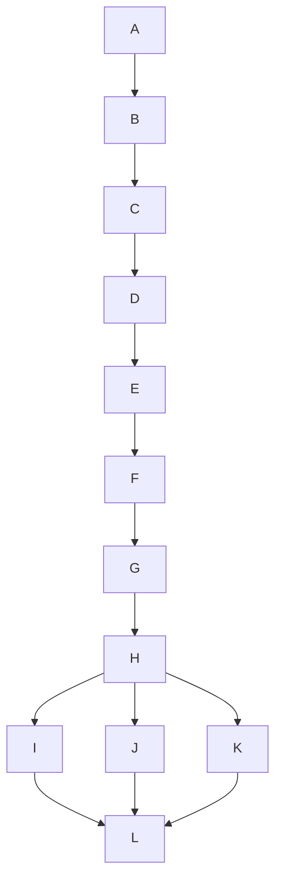
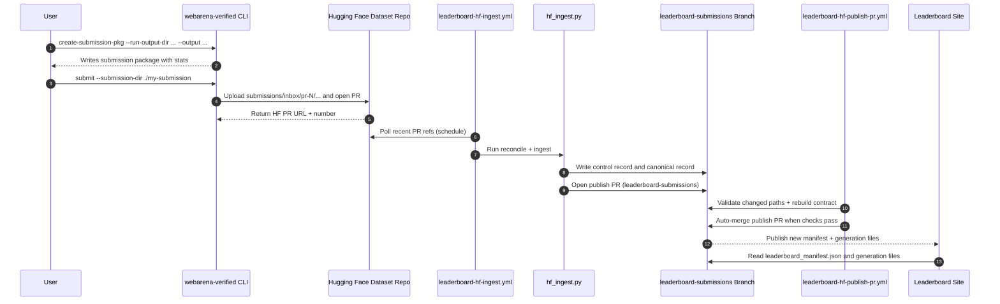
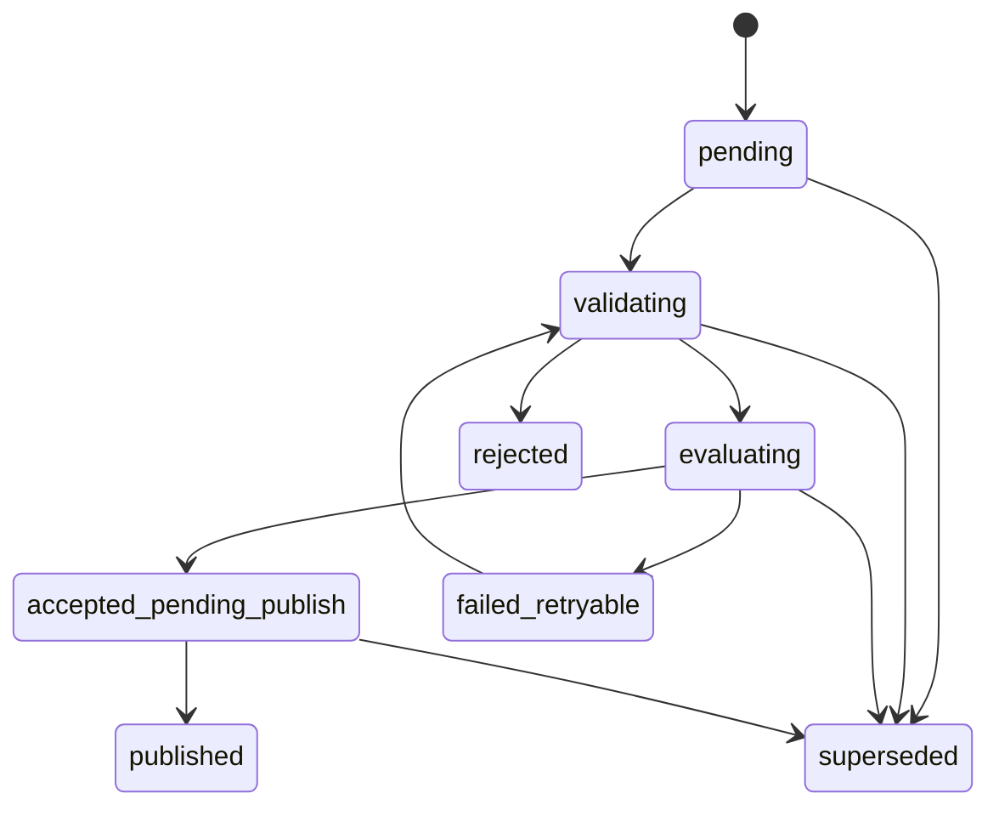

# Submission Flow

This page shows the end-to-end leaderboard submission flow from a user run directory to published leaderboard artifacts.

## 1) End-to-End Pipeline

Legend:

- `A`: User run outputs
- `B`: `create-submission-pkg`
- `C`: Submission package is created
- `D`: `submit --submission-dir`
- `E`: Hugging Face dataset PR inbox
- `F`: Scheduled ingest workflow
- `G`: Ingest + deterministic evaluation
- `H`: Publish PR on `leaderboard-submissions`
- `I`: Rebuild leaderboard artifacts
- `J`: Full leaderboard generation file
- `K`: Hard leaderboard generation file
- `L`: Site reads `leaderboard_manifest.json` and generation files

## 2) Sequence View

## 3) Submission Status Lifecycle

## Notes

- User-facing submit commands: `create-submission-pkg` and `submit`.
- Ingestion/reconciliation is schedule-driven and writes both control and canonical records.
- Leaderboard site rendering is manifest-driven: the site reads `leaderboard_manifest.json` and generation-specific full/hard files.
