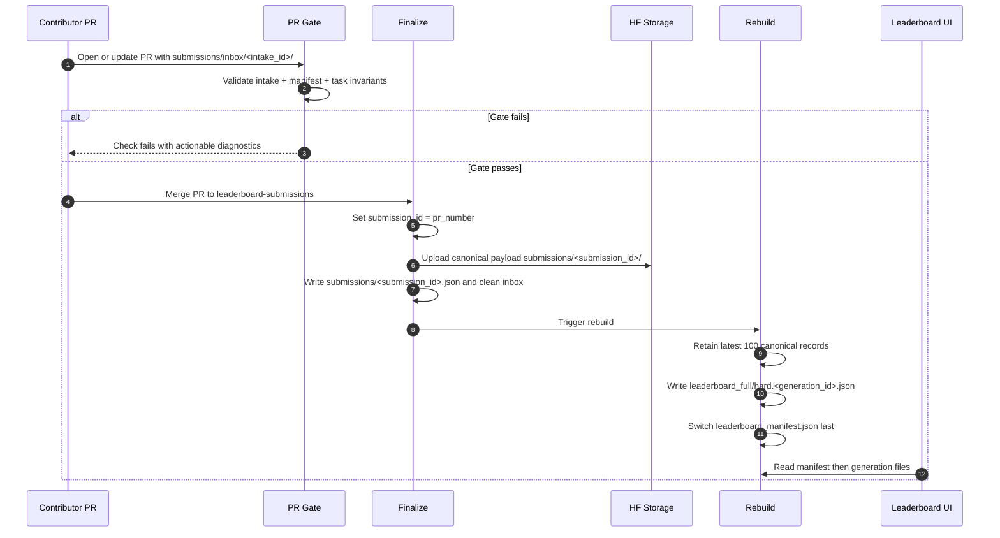

# Leaderboard System Guide (Contributors)

This document explains how the leaderboard system is structured, which component owns which data, and where to make changes safely.

## Architecture at a glance

The system is split into three workflow stages on `leaderboard-submissions`:

1. PR Gate (`pull_request`): validate intake payload and compute score preview (read-only).
2. Finalize (post-merge): canonicalize accepted submission and persist canonical record.
3. Rebuild (single writer): regenerate leaderboard artifacts and switch manifest atomically.

The UI reads `leaderboard_manifest.json`, then fetches immutable generation files referenced by the manifest.

## Flow diagram



## Branch roles

- `main`: source code, specs, and docs.
- `leaderboard-submissions`: intake payloads, canonical records, and leaderboard data outputs.
- `gh-pages`: docs-only site artifacts.

Contributor rule of thumb: treat `leaderboard-submissions` as data/control-plane state, not feature development code.

## Storage model and ownership boundaries

```text
submissions/
  inbox/
    <intake_id>/
      submission.json
      manifest.json
      tasks/
        <task_id>/agent_response.json
        <task_id>/network.har
        <task_id>/.missing
  <submission_id>.json

leaderboard_full.<generation_id>.json
leaderboard_hard.<generation_id>.json
leaderboard_manifest.json
```

Write ownership:

- user-editable path: `submissions/inbox/<intake_id>/**`
- Finalize-only write: `submissions/<submission_id>.json`
- Rebuild-only writes:
  - `leaderboard_full.<generation_id>.json`
  - `leaderboard_hard.<generation_id>.json`
  - `leaderboard_manifest.json`

## Canonical identity and contracts

- canonical id rule: `submission_id = <github_pr_number>`
- intake path: `submissions/inbox/<intake_id>/...`
- canonical accepted record: `submissions/<submission_id>.json`
- canonical record carries PR/source provenance plus scoring fields used by rebuild

Contract details and field-level schema are maintained in:

- `leaderboard/spec/leaderboard_submission_spec.md`
- `.wip/lane-b-contracts.md`
- `.wip/leaderboard-alignment-plan.md`

## Workflow responsibilities

PR Gate:

- trigger: submission PRs on `leaderboard-submissions`
- validates folder shape, manifest hash/size integrity, task invariants
- posts actionable diagnostics
- no branch writes, no HF writes

Finalize:

- trigger: merged submission PR
- sets canonical id from PR number
- captures provenance from PR event
- uploads canonical payload to HF path `submissions/<submission_id>/`
- writes `submissions/<submission_id>.json`
- removes merged inbox folder

Rebuild:

- trigger: finalize success or manual dispatch
- single-writer concurrency group for leaderboard outputs
- retains latest 100 canonical records
- writes generation files first, manifest last

## Governance and policy

Active governance baseline (Lane A):

- PR-only intake on `leaderboard-submissions` (no direct pushes)
- strict fork policy for non-contributors
- contributor bypass roles: `write`, `maintain`, `admin`
- default `GITHUB_TOKEN` workflow permission reduced to read; workflows grant write explicitly when required

Reference: `.wip/lane-a-governance.md`

## Contributor change map

If you are changing intake validation:

- update PR Gate logic and tests
- keep diagnostics deterministic and path-specific
- do not add branch mutation side effects

If you are changing canonical record fields:

- update schemas and record writers/readers together
- keep `submission_id = pr_number` invariant
- preserve provenance field population from PR metadata

If you are changing leaderboard generation:

- keep Rebuild as sole writer of leaderboard outputs
- preserve retention ordering and size (`latest 100`)
- keep atomic publish order (generation files first, manifest last)

## Certification checklist

Before calling leaderboard changes done, verify:

- intake validation is deterministic and actionable
- canonical record is complete and uses deterministic identity
- rebuild is the only writer for leaderboard outputs
- manifest never points to missing generation files
- UI reads latest manifest and corresponding generation files successfully
