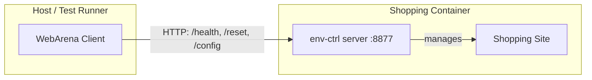

# environment_control

A lightweight utility for WebArena test environment containers that enables self-contained environment management.

## Why?

Without this package, setting up a test environment requires:
1. Starting the Docker container
2. Using `docker exec` to run setup commands (e.g., configuring external URLs)

This approach has two main issues:

1. **Version mismatch** - Setup commands may change between versions, requiring maintenance of different setup scripts for different environment versions.
2. **Limited container access** - In some deployment scenarios (e.g., Kubernetes, managed container services), accessing the internal Docker daemon or running `docker exec` is either not allowed or difficult to configure.

## How It Works

The package is installed inside each test environment container and exposes environment management operations through two interfaces:

- **CLI** - For direct access via `docker exec`
- **HTTP API** - For remote access without requiring Docker access

This makes each test environment site fully self-contained and provides a consistent interface across all test environments (shopping, reddit, gitlab, etc.), regardless of their underlying implementation.

## Architecture



The client library communicates with `env-ctrl` running inside each container, allowing operations like health checks, resets, and configuration changes without direct Docker access.

## Installation

```bash
pip install .
```

## Usage

### Via Docker Exec (CLI)

When you have Docker access, you can use the CLI directly:

```bash
# List available environment types
docker exec <container> env-ctrl list

# Check status
docker exec <container> env-ctrl status

# Start the HTTP server
docker exec <container> env-ctrl serve --port 8877
```

### Via HTTP API

When the server is running, interact with it over HTTP:

```bash
curl http://localhost:8877/health
curl -X POST http://localhost:8877/reset
```

For programmatic access, use the client classes from the main `webarena` library (see `webarena.environments`).

### Direct Python Usage (inside container)

```python
from environment_control import get_ops_class

ops = get_ops_class("shopping")
result = ops.get_health()
print(result.success)
```
